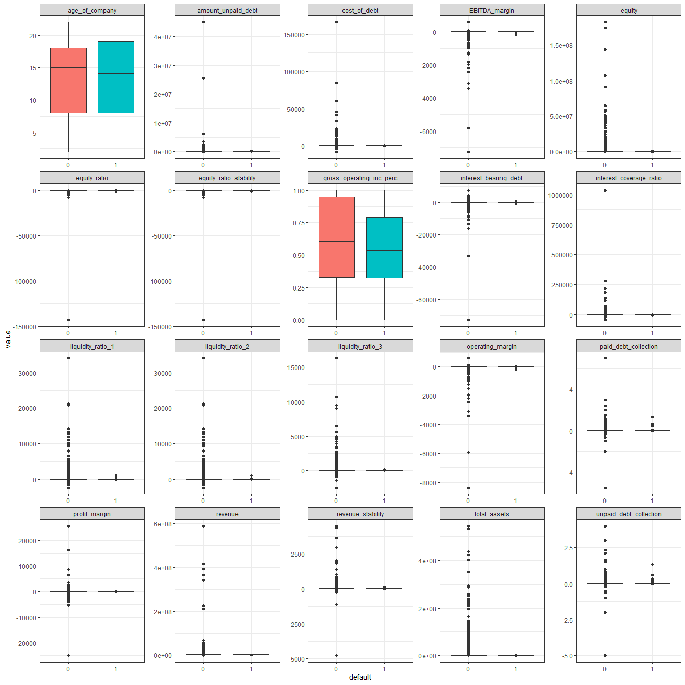
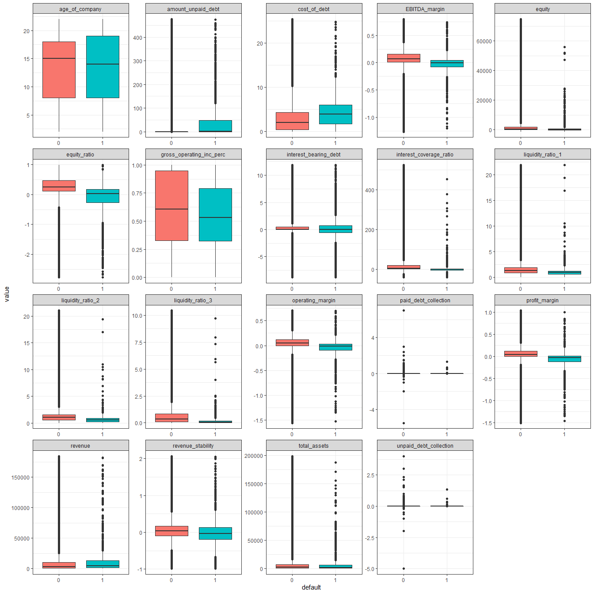
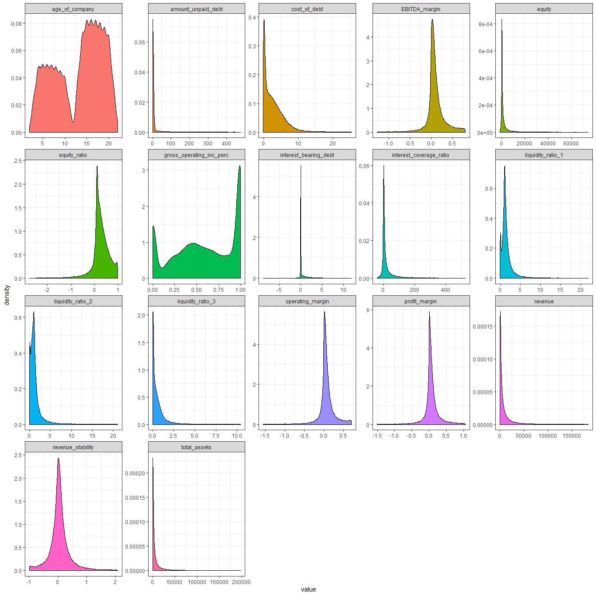
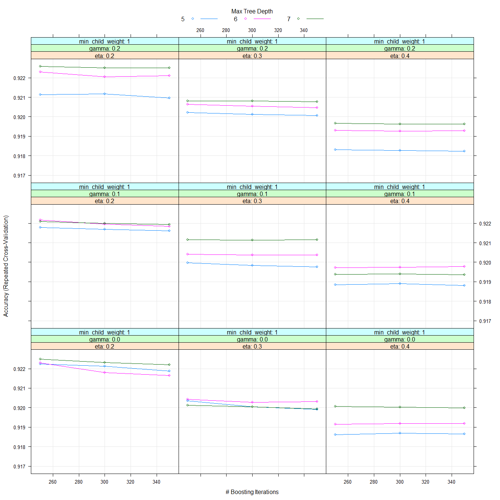
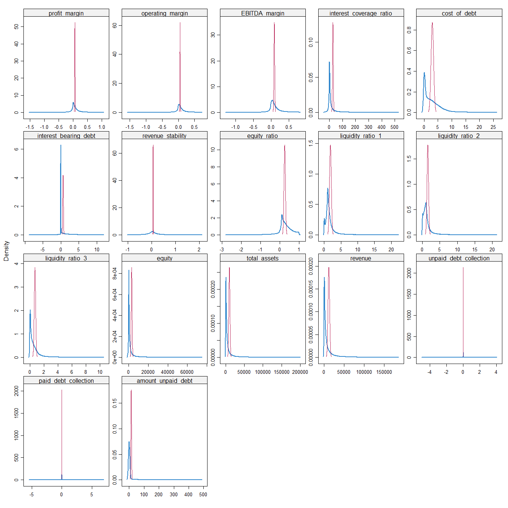
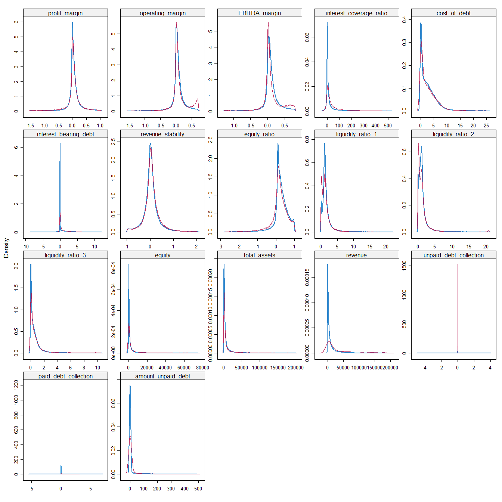

---
title: "Habits"
output:
  pdf_document:
    toc: yes
    toc_depth: '2'
  html_document:
    toc: yes
    toc_depth: 2
---


```{r setup, echo = F}
knitr::opts_chunk$set(echo = FALSE, warning = FALSE, message = FALSE, error = FALSE, results = 'asis', out.height = "\\textheight",  out.width = "\\textwidth")

```

\pagebreak


hsuaihteiayu


```{r}

library(dplyr)
library(magrittr)
library(tidyr)
library(ggplot2)
library(Hmisc)
library(purrr)
library(caret)
library(ranger)
library(xgboost)
library(kableExtra) # just to make the output nicer
library(mice)
library(stargazer)
library(xtable)
library(pROC)
library(knitr)
library(grid)

options(xtable.comment=FALSE)

theme_set(theme_bw()) 

df <- read.csv("pd_data_v2.csv", sep = ";", header = TRUE)

df_corp <- df

```

# Task 1: Predicion modelling

## Part 1: Inspecting, cleaning and imputing the data set 

In this section, we will train and rund three different prediction models based on a data set containing financial records of a list of companies. In total, there are 24 variables in the data set and xxx observations. Prior to training our prediction models, we load and examine the data set.

The first thing we notice is that some variables are classified as numeric when they should be factor variables, and vice versa. We reclassify these variables. 


```{r}

stargazer(df_corp, summary.stat = c("min","max"),header = FALSE, title  = "Summary statistics")

```

Table xx displays summary statistics of our data. As shown in the table, the value xx is present in many of the observations. Most likely, these values represent measurement errors or missing variables, and we therefore choose to replace these values with NAs. After completing this step, there are still some quite extreme outliers remaining in the data. Our assessment is that these values do not represent real observations, as they deviate from typical values for the financial key figures represented in the variables in question. Applying a threshold of 2,5 percent at each end of the variables' distribution, we replace values exceeding this threshold with NAs.  

We also notice that the variable default, which will be the dependent variable in our prediction models, is imbalanced. That is, observations of defaulting companies are underrepresented, which will make it difficult to predict defaults. The underrepresentation of defaults is illustrated in figure \ref{fig:imbalance}. we will handle this imbalance when we implement the prediction models in section xx.

```{r hist, fig.cap="\\label{fig:hist}Histogram of the distribution"}

df_corp$default <- as.factor(df_corp$default) 

df_corp %>% 
  ggplot(aes(x = default, fill = default)) +
  geom_bar() +
  ggtitle("Distribution of the none-default/default") +
  theme(plot.title = element_text(hjust = 0.5))

```


```{r, include = FALSE}

# Look at the distribution and recategorize the factor classes

# Adverse_audit_opinion


xtable(table(df_corp$default, df_corp$adverse_audit_opinion))

df_corp$adverse_audit_opinion <- 
  ifelse(df_corp$adverse_audit_opinion == 0, yes = 0, no = 1)

xtable(table(df_corp$default, df_corp$adverse_audit_opinion)) # If you got any Adverse audit opinons then its show as 1

# Industry

xtable(table(df_corp$default, df_corp$industry)) # As we don't know anything about the type of industry we let it be

# Payment_reminders

xtable(table(df_corp$default, df_corp$payment_reminders)) # Ok

# Change classes

df_corp$adverse_audit_opinion <- as.factor(df_corp$adverse_audit_opinion) 
df_corp$industry <- as.factor(df_corp$industry)
df_corp$payment_reminders <- as.factor(df_corp$payment_reminders) 
df_corp$equity <- as.numeric(df_corp$equity)
df_corp$total_assets <- as.numeric(df_corp$total_assets)
df_corp$revenue <- as.numeric(df_corp$revenue)
df_corp$age_of_company <- as.numeric(df_corp$age_of_company)


# Take a closer look on the distribution of the values we belive is errors

x <- df_corp %>% 
  select_if(is.numeric)

placeholder <- matrix(ncol=ncol(x), nrow=1)
colnames(placeholder) <- names(x)

for(i in 1:ncol(x)){
  placeholder[,i] <- ifelse(x[,i] > 100000000000 , yes = 1 , 
                            no = ifelse(x[,i] < -100000000000, yes = 1, no = 0)) %>% 
    sum()
}


as.data.frame(placeholder/nrow(df_corp)) %>%
  gather() %>% 
  xtable()

# Changes the obvious errors to NA

df_corp[df_corp < -1000000000000000] <- NA 
df_corp[df_corp >  1000000000000000] <- NA

stargazer(df_corp, summary.stat = c("min","max","mean","sd"), header = FALSE, title = "Summary statistics")

```


```{r, fig.asp=1, fig.width = 14, eval= FALSE, include=FALSE}

# We take a new look after replacing the errors with NA
# Mia: Can we delete this chunck? Think adding another graph is a bit exessive. 

df_corp %>% 
  select(which(sapply(.,class)=="numeric"),default) %>%   
  gather(metric, value, -default) %>% 
  ggplot(aes(x= default, y=value, fill = default))+
  geom_boxplot(show.legend = FALSE) +
  facet_wrap(~ metric, scales = "free")

# We definitly need to do something about those outliers, only gross_operating_inc_perc and age_of_company seems to be okay.

```


```{r pre_boxplot, out.width='100%', include = T, fig.cap="\\label{fig:pre_boxplot}plotting example"}



```

```{r}

################## Dealing with the outliers ######################


# Function for replacing outliers with NA's

remove_outliers_na <- function(x) { # To be used on other variables
  qnt <- as.vector(quantile(x, probs=c(0.025, 0.975), na.rm = TRUE))
  y <- x
  y[x < qnt[1]] <- NA
  y[x > qnt[2]] <- NA
  y
}

# Strategy: We set NA on all outliers that are less then 0.025 and more than 0.975 the quantiles. 
#           This is done for all numeric variables except age_of_company, gross_operarting_inc_perc, paid_debt_collection and unpaid_debt collection.
#           paid and unpaid debt collection will be categorized.

df_corp$profit_margin <- remove_outliers_na(df_corp$profit_margin)
df_corp$operating_margin <- remove_outliers_na(df_corp$operating_margin)
df_corp$EBITDA_margin <- remove_outliers_na(df_corp$EBITDA_margin)
df_corp$interest_coverage_ratio <- remove_outliers_na(df_corp$interest_coverage_ratio)
df_corp$cost_of_debt <- remove_outliers_na(df_corp$cost_of_debt)
df_corp$interest_bearing_debt <- remove_outliers_na(df_corp$interest_bearing_debt)
df_corp$revenue_stability <- remove_outliers_na(df_corp$revenue_stability)
df_corp$equity_ratio <- remove_outliers_na(df_corp$equity_ratio)
df_corp$equity_ratio_stability <- remove_outliers_na(df_corp$equity_ratio_stability)
df_corp$liquidity_ratio_1 <- remove_outliers_na(df_corp$liquidity_ratio_1)
df_corp$liquidity_ratio_2 <- remove_outliers_na(df_corp$liquidity_ratio_2)
df_corp$liquidity_ratio_3 <- remove_outliers_na(df_corp$liquidity_ratio_3)
df_corp$equity <- remove_outliers_na(df_corp$equity)
df_corp$total_assets <- remove_outliers_na(df_corp$total_assets)
df_corp$revenue <- remove_outliers_na(df_corp$revenue)
df_corp$amount_unpaid_debt <- remove_outliers_na(df_corp$amount_unpaid_debt)


df_corp <- df_corp %>% 
  select(-equity_ratio_stability) # Removed due to collinearity and if look at the earlier plots it make sense.

```

```{r,fig.asp=1, fig.width = 14, eval=FALSE}

temp_imputed1 <- mice(df_corp, m=2,maxit=3,meth='mean',seed=500)

temp_imputed2 <- mice(df_corp, m=2,maxit=3,meth='pmm',seed=500)

saveRDS(temp_imputed1, file = "imputeMEAN.Rdata")

saveRDS(temp_imputed2, file = "impute.Rdata") 

densityplot(temp_imputed1, drop.unused.levels = TRUE)

densityplot(temp_imputed2, drop.unused.levels = TRUE)

# Running the imputations and generating density plots of the imputed values is higly time consuming. Therefore, we upload the saved files and  plots instead. 
# See appendix for plots. 
```

```{r, include = FALSE, include=FALSE}

temp_imputed1 <- readRDS(file = "imputeMEAN.Rdata")
temp_imputed2 <- readRDS(file = "impute.Rdata")

# We complete the impution and check the result

complete_imputed <- complete(temp_imputed2, 1)

Orginal <- dim(df_corp)
Imputed <- dim(complete_imputed)

xtable(rbind(Orginal, Imputed))

df_cleaned <- complete_imputed

```

```{r, include = FALSE}

df_cleaned$unpaid_debt_collection <- ifelse(df_cleaned$unpaid_debt_collection > 0, yes = 1, no = 0) # 1 = have unpaid debt collection

df_cleaned$paid_debt_collection <- ifelse(df_cleaned$paid_debt_collection > 0, yes = 1, no = 0) # 1 = have previously had debt collection

df_cleaned$paid_debt_collection <- as.factor(df_cleaned$paid_debt_collection)
df_cleaned$unpaid_debt_collection <- as.factor(df_cleaned$unpaid_debt_collection)

table1 <- table(df_cleaned$default, df_cleaned$unpaid_debt_collection)
table2 <- table(df_cleaned$default, df_cleaned$paid_debt_collection)

xtable(table1)
xtable(table2)

```
 
```{r, fig.asp=1, fig.width = 14, eval=FALSE}

# Looking at the distribution again

df_corp %>% 
  select(which(sapply(.,class)=="numeric"),default) %>%   
  gather(metric, value, -default) %>% 
  ggplot(aes(x= default, y=value, fill = default))+
  geom_boxplot(show.legend = FALSE) +
  facet_wrap(~ metric, scales = "free")

df_cleaned %>% 
  select_if(is.numeric) %>% 
  gather(metric, value) %>% 
  ggplot(aes(value, fill = metric))+
  geom_density(show.legend = FALSE) +
  facet_wrap(~ metric, scales = "free")


# Running this chunk is time consuming, and we have therefore saved the figures. They are reloaded in the chunk below.  

```

Figure \ref{fig:boxpot_post_cleaning} and \ref{fig:density_post_cleaning} contain box- and density plots of the numeric variables in our data set after cleaning:

```{r, echo=FALSE, out.width='100%'}





```

After cleaning the data set, we are left with xx missing values. As these account for a substantial fraction of the total number of observations in the data set, we choose to impute these using the MICE package. An illustration and explanation of the imputation added to the appendix.


##Prediction modelling

### Preparations


XXX Blalala the data is split into a training set and a test set.

Prior to training our prediction models, we run the data set through a function which detects whether any of the variables correlate. It turns out that the variables \textit{total assets}, \textit{revenue}, \textit{industry} and \textit{paid debt collection} correlate with one or more of the other variables. To avoid multicollinearity, these variables are removed from the data set.  


```{r, include = FALSE}

df_reduced <- df_cleaned

set.seed(1)
index <- createDataPartition(df_reduced$default, p = 0.7, list = FALSE)
train_data <- df_reduced[index, ]
test_data <- df_reduced[-index, ]

# Check

nrow(train_data) + nrow(test_data) == nrow(df_reduced)


# We first check the correlation between the numeric variables

cor_df <- train_data %>% 
  select_if(is.numeric)

# Make a function that print variables that correlates more than a threshold

corr_check <- function(data, threshold){
  mat_cor <- cor(data)
  mat_cor
  
  for (i in 1:nrow(mat_cor)){
    correlations <-  which((abs(mat_cor[i,i:ncol(mat_cor)]) > threshold) & (mat_cor[i,i:ncol(mat_cor)] != 1))
    
    if(length(correlations)> 0){
      lapply(correlations,FUN =  function(x) (cat(paste(colnames(data)[i], "with",colnames(data)[x]), "\n")))
      
    }
  }
}


cor_mat <- corr_check(cor_df, 0.7)

train_data <- train_data %>% 
  select(-operating_margin, -liquidity_ratio_1, -EBITDA_margin, -equity)

```

```{r, include = FALSE}

`Train defaults`<- summary(train_data$default)[2]/nrow(train_data)

`Test defaults`<- summary(test_data$default)[2]/nrow(test_data)

xtable(rbind(`Train defaults`,`Test defaults`))

```

```{r}

############# Making some models ###################

# Removed variables

train_data <- train_data %>% 
  select(-total_assets, -revenue, -industry, -paid_debt_collection)

ctrl <- trainControl(method = "repeatedcv", 
                     number = 10, 
                     repeats =10, 
                     verboseIter = FALSE,
                     sampling = "smote")

```

### Logistic Regression Model

Our first prediction model is a logistic regression model. 
- Using cross validation: ten fold, 
- Oversampling method (smote) implemented here
- Variable selection: choosing varibles, and why. Not relative values etc etc


Summary statistics from the logistic regression model are presented in table xxxx. 
- comments: which variables are significant, and do they make economically sense

Figure xxx gives and overview of the variable importance.  
- Comments: 

A confusion matrix from the glm model is presented in table xx. 
- Comments: 

Figure xx shows the AUC for the glm model. 
- Comments: 


```{r, cache= TRUE}

#set eval true later

set.seed(1)

model_glm <- train(default ~.,
                   data = train_data,
                   method = "glm",
                   trControl = ctrl)


```


```{r}

summary_glm <- xtable(summary(model_glm), caption = "Summary glm model")

print(summary_glm, scalebox=1, caption.placement = "top", label = "tab:sumtable")

plot(varImp(model_glm))

glm_pred <- data.frame(actual = test_data$default,
                       predict(model_glm, newdata = test_data, type = "prob"))

glm_pred$predict <- ifelse(glm_pred$X1 > 0.5, 1, 0)
glm_pred$predict <- as.factor(glm_pred$predict)

cm_glm <-confusionMatrix(glm_pred$predict, test_data$default)


confusion_glm <- xtable(as.matrix(cm_glm$table), caption = "Confusion matrix GLM")

print(confusion_glm, scalebox = 1, caption.placement = "top", label = "tab:confusion_glm")

perf_glm <- as.matrix(cm_glm$byClass)
colnames(perf_glm) <- c("Values")

performance_glm <- xtable(perf_glm, caption = "Performance indicators GLM")

print(performance_glm, scalebox = 1, caption.placement = "top", label = "tab:performance_glm")
```


```{r}

# ROC curve glm

result.predicted.prob <- predict(model_glm, test_data, type="prob") # Prediction

result.roc <- roc(test_data$default, result.predicted.prob$`1`) # Draw ROC 

plot(result.roc, print.thres="best", print.thres.best.method="closest.topleft")

result.coords <- coords(result.roc, "best", best.method="closest.topleft", ret=c("threshold", "accuracy"))
print(result.coords)#to get threshold and accuracy

```

## Random forest

Our second predicion model is a random forest model.
Comments:
- We have implemented cross validation
- Fine tuning?
- Oversampling technique is also implemented here. 


The model's confusion matrics is presented in figure xx, and the ROC curve is presented in figure xx. 
- Discuss performance 


```{r, eval=FALSE}

############################ Model 2: Random Forest ######################################

set.seed(1)

model_rf <- caret::train(default ~ .,
                         data = train_data,
                         method = "rf",
                         preProcess = c("scale", "center"),
                         trControl = ctrl)


# saveRDS(model_rf, file = "rf.Rdata")


```

```{r}

model_rf <- readRDS("rf.Rdata")

plot(varImp(model_rf))

rf_pred <- data.frame(actual = test_data$default,
                      predict(model_rf, newdata = test_data, type = "prob"))
rf_pred$predict <- ifelse(rf_pred$X1 > 0.5, 1, 0)
rf_pred$predict <- as.factor(rf_pred$predict)

cm_rf <- confusionMatrix(rf_pred$predict, test_data$default)

xtable(as.matrix(cm_rf$table), caption = "Confusion matrix Rf")

perf_rf <- as.matrix(cm_rf$byClass)
colnames(perf_rf) <- c("Values")

xtable(perf_rf)
```


Comments:
About the confustion matrix
How well the model performs relative to glm
Accuracy, specificity and sensitivity etc.


```{r}

# ROC curve rf

result.predicted.prob <- predict(model_rf, test_data, type="prob") # Prediction

result.roc <- roc(test_data$default, result.predicted.prob$`1`) # Draw ROC 

plot(result.roc, print.thres="best", print.thres.best.method="closest.topleft")

result.coords <- coords(result.roc, "best", best.method="closest.topleft", ret=c("threshold", "accuracy"))
print(result.coords)#to get threshold and accuracy


# Running the model is highly time consuming.
#blablabla we run the saved file instead

```

 - #  Show ROC here # - 


```{r, eval = FALSE}
#Model 3: Xgboost

xgb_grid <- expand.grid(nrounds = 250,
                        max_depth = 7, 
                        min_child_weight = 1,
                        subsample = 1,
                        gamma = .2,
                        colsample_bytree = 0.8,
                        eta = .2)

set.seed(1)

model_xgb <- caret::train(default ~ .,
                          data = train_data,
                          method = "xgbTree",
                          tuneGrid =xgb_grid,
                          preProcess = c("scale", "center"),
                          trControl = ctrl)

# Check preProcess - is this necessary, is it right, or is it wrong??

# saveRDS(model_xgb, file = "xgb.Rdata")

```

```{r}
model_xgb <- readRDS("xgb.Rdata")

plot(varImp(model_xgb))

xgb_pred <- data.frame(actual = test_data$default,
                      predict(model_xgb, newdata = test_data, type = "prob"))

xgb_pred$predict <- ifelse(xgb_pred$X1 > 0.5, 1, 0)
xgb_pred$predict <- as.factor(xgb_pred$predict)

cm_xgb <- confusionMatrix(xgb_pred$predict, test_data$default)

xtable(as.matrix(cm_xgb$table))

perf_xgb <- as.matrix(cm_xgb$byClass)
colnames(perf_xgb) <- c("Values")

xtable(perf_xgb)

# ROC curve xgb

result.predicted.prob <- predict(model_xgb, test_data, type="prob") # Prediction

result.roc <- roc(test_data$default, result.predicted.prob$`1`) # Draw ROC curve.

plot(result.roc, print.thres="best", print.thres.best.method="closest.topleft")

result.coords <- coords(result.roc, "best", best.method="closest.topleft", ret=c("threshold", "accuracy"))
print(result.coords)#to get threshold and accuracy
```

```{r, echo=FALSE, out.width='100%'}



```

Accuracy and Kappa
These are the default metrics used to evaluate algorithms on binary and multi-class classification datasets in caret.

Accuracy is the percentage of correctly classifies instances out of all instances. It is more useful on a binary classification than multi-class classification problems because it can be less clear exactly how the accuracy breaks down across those classes (e.g. you need to go deeper with a confusion matrix). Learn more about Accuracy here.

Kappa or Cohen’s Kappa is like classification accuracy, except that it is normalized at the baseline of random chance on your dataset. It is a more useful measure to use on problems that have an imbalance in the classes (e.g. 70-30 split for classes 0 and 1 and you can achieve 70% accuracy by predicting all instances are for class 0). Learn more about Kappa here.

```{r, cache= TRUE}


# Look at the performance

models <- list(glm = model_glm,
               rf = model_rf,
               xgb = model_xgb)

resampling <- resamples(models)

bwplot(resampling)

comp_table <- summary(resampling) 

  
stargazer(comp_table$statistics$Accuracy, header = FALSE, title = "Accuracy" )
stargazer(comp_table$statistics$Kappa, header = FALSE, title = "Kappa")


```


#Appendix

```{r, echo=FALSE, out.width='100%', include = FALSE}


### load images 




```


