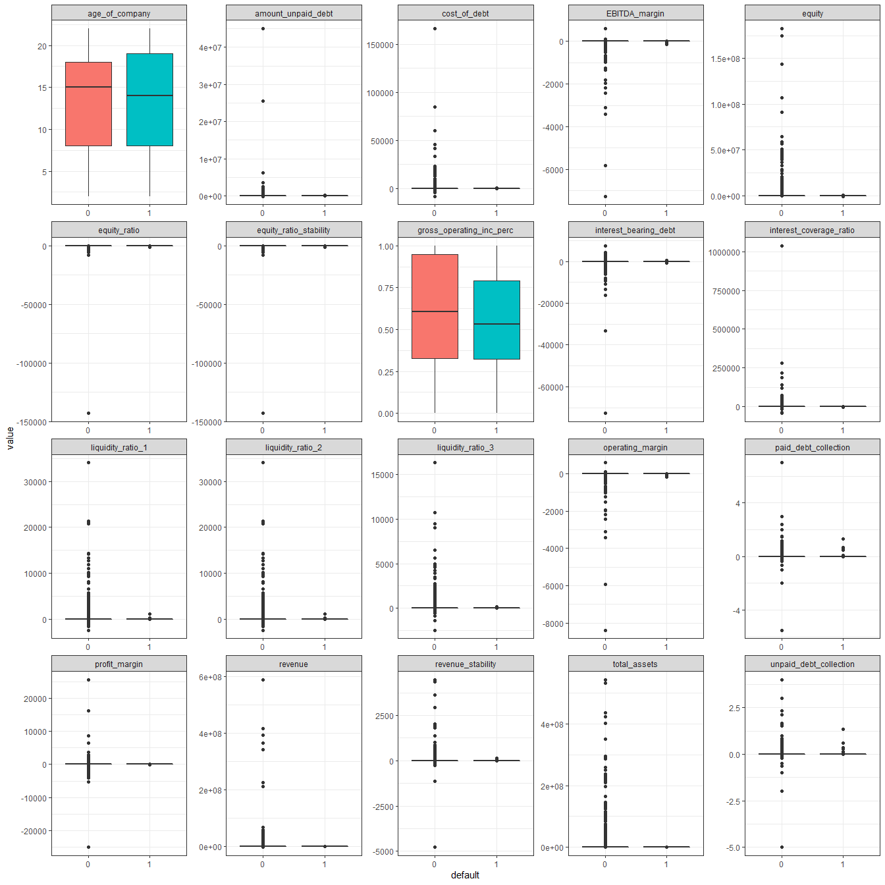
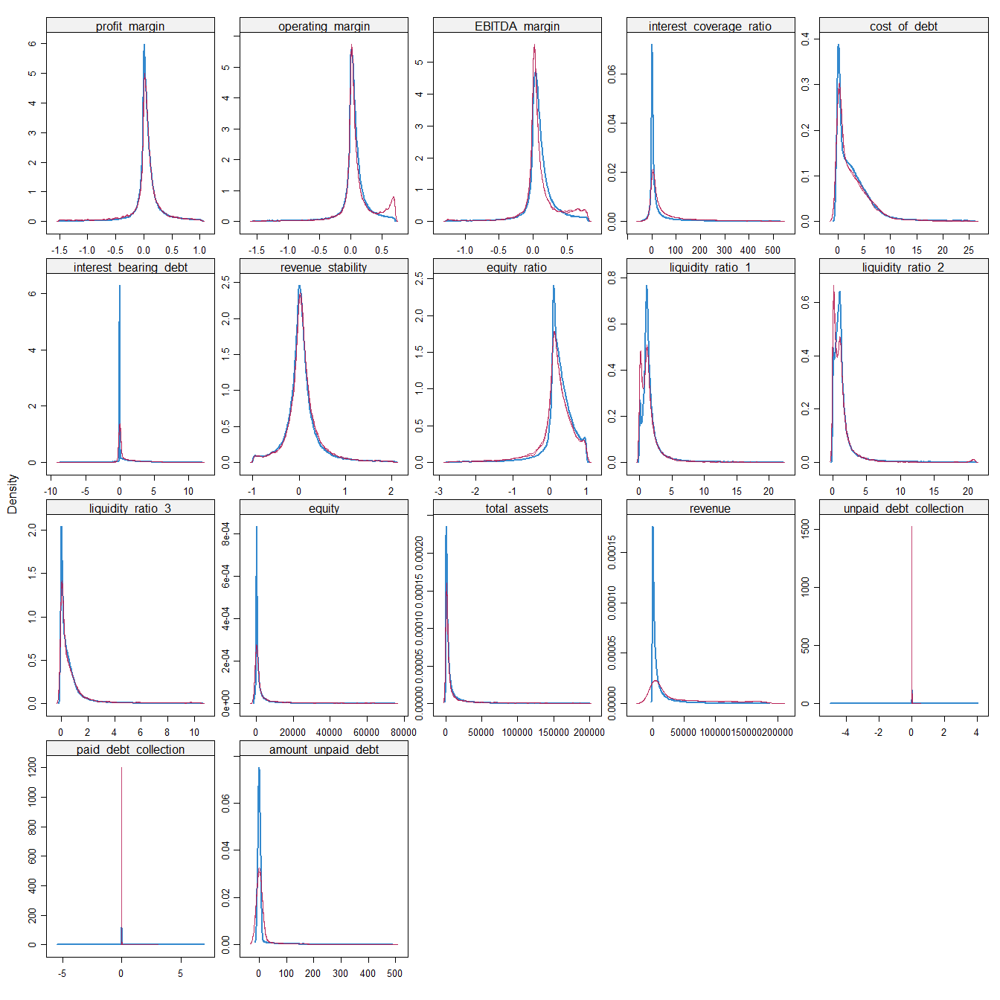
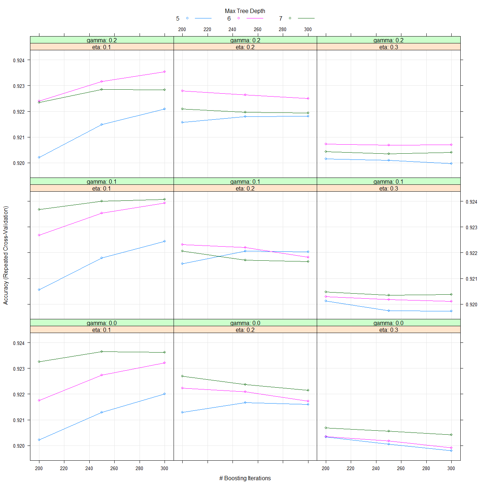

---
title: "Habits"
output:
  pdf_document:
    toc: yes
    toc_depth: '2'
  html_document:
    toc: yes
    toc_depth: 2
---


```{r setup, echo = F}
knitr::opts_chunk$set(echo = FALSE, warning = FALSE, message = FALSE, error = FALSE, results = 'asis', out.height = "\\textheight",  out.width = "\\textwidth")

```

\pagebreak


```{r}

library(dplyr)
library(magrittr)
library(tidyr)
library(ggplot2)
library(Hmisc)
library(purrr)
library(caret)
library(ranger)
library(xgboost)
library(kableExtra) # just to make the output nicer
library(mice)
library(stargazer)
library(xtable)
library(pROC)
library(knitr)
library(grid)

options(xtable.comment=FALSE)

theme_set(theme_bw()) 

df <- read.csv("pd_data_v2.csv", sep = ";", header = TRUE)

df_corp <- df
```
1. Setting up the data

An overview of the data shows us tha we have to change the structure of some of the variabels. Moreover, there are many extreme values in the data set and observations of defaulting companies are higly underrepresented in the data set. We will deal with all these problems prior to implementing our prediction models.  


```{r}

stargazer(df_corp, summary.stat = c("min","max"),header = FALSE)

df_corp$default <- as.factor(df_corp$default) 

df_corp %>% 
  ggplot(aes(x = default, fill = default)) +
  geom_bar()

```

Factor variables: 
Then we recategorize som of the factor variables. Adverse audit is coded as a dummy, where 1 indicates that there has been an adverse audit opinion, and 0 indicates no adverse audit.

The tables below show the distribution of the companies along the factor variables, depending on wether they have defaulted or not.

```{r}

# Look at the distribution and recategorize the factor classes

# Adverse_audit_opinion


xtable(table(df_corp$default, df_corp$adverse_audit_opinion))

df_corp$adverse_audit_opinion <- 
  ifelse(df_corp$adverse_audit_opinion == 0, yes = 0, no = 1)

xtable(table(df_corp$default, df_corp$adverse_audit_opinion)) # If you got any Adverse audit opinons then its show as 1

# Industry

xtable(table(df_corp$default, df_corp$industry)) # As we don't know anything about the type of industry we let it be

# Payment_reminders

xtable(table(df_corp$default, df_corp$payment_reminders)) # Ok

# Change classes

df_corp$adverse_audit_opinion <- as.factor(df_corp$adverse_audit_opinion) 
df_corp$industry <- as.factor(df_corp$industry)
df_corp$payment_reminders <- as.factor(df_corp$payment_reminders) 
df_corp$equity <- as.numeric(df_corp$equity)
df_corp$total_assets <- as.numeric(df_corp$total_assets)
df_corp$revenue <- as.numeric(df_corp$revenue)
df_corp$age_of_company <- as.numeric(df_corp$age_of_company)


```
Let's have a look of the distribution of the variables in the data set. The figure below contains density plots for all the numeric variables. Due to the presence of outliers, these figures do not provide much information. 


#Handling missing observations and outliers

We observe that the number xx appears throughout the data set, and assume that these are missing observations. In total, these extreme values account for xx percent of our observations. 


We choose to replace these values with NA to begin with.  

```{r}
# Take a closer look on the distribution of the values we belive is errors

x <- df_corp %>% 
  select_if(is.numeric)

placeholder <- matrix(ncol=ncol(x), nrow=1)
colnames(placeholder) <- names(x)

for(i in 1:ncol(x)){
  placeholder[,i] <- ifelse(x[,i] > 100000000000 , yes = 1 , 
                            no = ifelse(x[,i] < -100000000000, yes = 1, no = 0)) %>% 
    sum()
}


as.data.frame(placeholder/nrow(df_corp)) %>%
  gather() %>% 
  xtable()

# Changes the obvious errors to NA

df_corp[df_corp < -1000000000000000] <- NA 
df_corp[df_corp >  1000000000000000] <- NA

stargazer(df_corp, summary.stat = c("min","max","mean","sd"), header = FALSE)

```

```{r, fig.asp=1, fig.width = 14, eval= FALSE}

df_corp %>% 
   select_if(is.numeric) %>% 
   gather(metric, value) %>% 
   ggplot(aes(value, fill = metric))+
   geom_density(show.legend = FALSE) +
   facet_wrap(~ metric, scales = "free")

```


```{r, out.width='100%'}


```
The figures below show the distribution after replacing xxx with NA. As shown, we still have an issue with outliers.


```{r, fig.asp=1, fig.width = 14, eval= FALSE}

# We take a new look after we changed the error with NA

df_corp %>% 
  select(which(sapply(.,class)=="numeric"),default) %>%   
  gather(metric, value, -default) %>% 
  ggplot(aes(x= default, y=value, fill = default))+
  geom_boxplot(show.legend = FALSE) +
  facet_wrap(~ metric, scales = "free")

# We definitly need to do something about those outliers, only gross_operating_inc_perc and age_of_company seems to be okay.

#Mia: These figures might be a bit excessive?


```

```{r, out.width='100%'}



```


We assume that many of these values are error measurements. Applying a treshold of 2,5 percent at each end of the variables' distribution, we replace values exceeding this treshold with NAs. 


```{r}

################## Dealing with the outliers ######################


# Function for replacing outliers with NA's

remove_outliers_na <- function(x) { # To be used on other variables
  qnt <- as.vector(quantile(x, probs=c(0.025, 0.975), na.rm = TRUE))
  y <- x
  y[x < qnt[1]] <- NA
  y[x > qnt[2]] <- NA
  y
}

# Strategy: We set NA on all outliers that are less then 0.025 and more than 0.975 the quantiles. 
#           This is done for all numeric variables except age_of_company, gross_operarting_inc_perc, paid_debt_collection and unpaid_debt collection.
#           paid and unpaid debt collection will be categorized.

df_corp$profit_margin <- remove_outliers_na(df_corp$profit_margin)
df_corp$operating_margin <- remove_outliers_na(df_corp$operating_margin)
df_corp$EBITDA_margin <- remove_outliers_na(df_corp$EBITDA_margin)
df_corp$interest_coverage_ratio <- remove_outliers_na(df_corp$interest_coverage_ratio)
df_corp$cost_of_debt <- remove_outliers_na(df_corp$cost_of_debt)
df_corp$interest_bearing_debt <- remove_outliers_na(df_corp$interest_bearing_debt)
df_corp$revenue_stability <- remove_outliers_na(df_corp$revenue_stability)
df_corp$equity_ratio <- remove_outliers_na(df_corp$equity_ratio)
df_corp$equity_ratio_stability <- remove_outliers_na(df_corp$equity_ratio_stability)
df_corp$liquidity_ratio_1 <- remove_outliers_na(df_corp$liquidity_ratio_1)
df_corp$liquidity_ratio_2 <- remove_outliers_na(df_corp$liquidity_ratio_2)
df_corp$liquidity_ratio_3 <- remove_outliers_na(df_corp$liquidity_ratio_3)
df_corp$equity <- remove_outliers_na(df_corp$equity)
df_corp$total_assets <- remove_outliers_na(df_corp$total_assets)
df_corp$revenue <- remove_outliers_na(df_corp$revenue)
df_corp$amount_unpaid_debt <- remove_outliers_na(df_corp$amount_unpaid_debt)

```

Mia: Might mention that equity ratio stability seems to have exactly same distribution as equity ratio. We test for correlation etc etc and end up removing this variable moving forward. Saves some computation time for r when imputing.  

# Imputation

As we have as much as xxx NA's, we choose not to delete these values, but rather impute them using the MICE package. 

We deploy two methods for imputation: mean and ppm.
Explain: 
- ppm and why it is good
- why imputation can introduce challenges 
- 

The tables below show how the distributions change when we apply different imputation methods. The original data is shown in the blue line, the mean imoutation in xxx line, and the pmm method in the xxx line. 


```{r, include = FALSE}

df_corp <- df_corp %>% 
  select(-equity_ratio_stability) # Removed due to collinearity and if look at the earlier plots it make sense.

```


```{r,fig.asp=1, fig.width = 14, eval=FALSE}

temp_imputed1 <- mice(df_corp, m=2,maxit=3,meth='mean',seed=500)

temp_imputed2 <- mice(df_corp, m=2,maxit=3,meth='pmm',seed=500)

saveRDS(temp_imputed1, file = "imputeMEAN.Rdata")

saveRDS(temp_imputed2, file = "impute.Rdata") 


densityplot(temp_imputed1, drop.unused.levels = TRUE)

densityplot(temp_imputed2, drop.unused.levels = TRUE)

# Running the imputations and generating density plots of the imputed values is higly time consuming. Therefore, we upload the saved files and  plots instead. 
```


```{r, echo=FALSE, out.width='100%'}

temp_imputed1 <- readRDS(file = "imputeMEAN.Rdata")
temp_imputed2 <- readRDS(file = "impute.Rdata")

### load images 

include_graphics('imputation_mean.jpeg')


```


```{r}

# We complete the impution and check the result

complete_imputed <- complete(temp_imputed2, 1)

Orginal <- dim(df_corp)
Imputed <- dim(complete_imputed)

xtable(rbind(Orginal, Imputed))

df_cleaned <- complete_imputed

```

As shown in the distribtion plots, there is not much variation in the variables measuring paid and unpaid debt collection. We generate two new dummy variables that provide two binary measures of paid and unpaid debt. Moreover, 

The table below shows how this variable is distributed. As shown, defaulting firms are more frequently represented among those with debt collection. Moreover, firms who have reported paying down previous debt are less frequently represented among defaulters.  

Mia: Might need to work on the reasoning behind generating this dummy a bit more. Could we do without it? 


```{r}

df_cleaned$unpaid_debt_collection <- ifelse(df_cleaned$unpaid_debt_collection > 0, yes = 1, no = 0) # 1 = have unpaid debt collection

df_cleaned$paid_debt_collection <- ifelse(df_cleaned$paid_debt_collection > 0, yes = 1, no = 0) # 1 = have previously had debt collection

df_cleaned$paid_debt_collection <- as.factor(df_cleaned$paid_debt_collection)
df_cleaned$unpaid_debt_collection <- as.factor(df_cleaned$unpaid_debt_collection)

table1 <- table(df_cleaned$default, df_cleaned$unpaid_debt_collection)
table2 <- table(df_cleaned$default, df_cleaned$paid_debt_collection)

xtable(table1)
xtable(table2)

```

After cleaning, imputing and restructuring our data set is better suited for prediciton modelling, see density plots below. 

```{r, fig.asp=1, fig.width = 14, eval=FALSE}

# Looking at the distribution again

df_corp %>% 
  select(which(sapply(.,class)=="numeric"),default) %>%   
  gather(metric, value, -default) %>% 
  ggplot(aes(x= default, y=value, fill = default))+
  geom_boxplot(show.legend = FALSE) +
  facet_wrap(~ metric, scales = "free")

df_cleaned %>% 
  select_if(is.numeric) %>% 
  gather(metric, value) %>% 
  ggplot(aes(value, fill = metric))+
  geom_density(show.legend = FALSE) +
  facet_wrap(~ metric, scales = "free")

```

```{r, echo=FALSE, out.width='100%'}

include_graphics('boxplot_post_cleaning.jpeg')
include_graphics('density_post_cleaning.jpeg')

```

#Modelling preparations
A few more steps before we are ready to start modelling: 

We split the data frame into a training and test set.
The variables total_assets, revenue, industry and paid_debt_collection are removed as they correlate with other independent variables. 


```{r}

df_reduced <- df_cleaned

set.seed(1)
index <- createDataPartition(df_reduced$default, p = 0.7, list = FALSE)
train_data <- df_reduced[index, ]
test_data <- df_reduced[-index, ]

# Check

nrow(train_data) + nrow(test_data) == nrow(df_reduced)


# We first check the correlation between the numeric variables

cor_df <- train_data %>% 
  select_if(is.numeric)

# Make a function that print variables that correlates more than a threshold

corr_check <- function(data, threshold){
  mat_cor <- cor(data)
  mat_cor
  
  for (i in 1:nrow(mat_cor)){
    correlations <-  which((abs(mat_cor[i,i:ncol(mat_cor)]) > threshold) & (mat_cor[i,i:ncol(mat_cor)] != 1))
    
    if(length(correlations)> 0){
      lapply(correlations,FUN =  function(x) (cat(paste(colnames(data)[i], "with",colnames(data)[x]), "\n")))
      
    }
  }
}

# corr_check(cor_df, 0.7)

train_data <- train_data %>% 
  select(-operating_margin, -liquidity_ratio_1, -EBITDA_margin, -equity)

# Secondly we check the correlation with the cateorized variables

```

```{r}

`Train defaults`<- summary(train_data$default)[2]/nrow(train_data)

`Test defaults`<- summary(test_data$default)[2]/nrow(test_data)

xtable(rbind(`Train defaults`,`Test defaults`))

```

# Dealing with data imbalance

As mentioned, defaulting firms are highly underrepresentated in the data set. We deal with this by implementing the oversamlpling technique "smote".
- Writ some sentences about smote. 

```{r}


############# Making some models ###################


# Removed variables

train_data <- train_data %>% 
  select(-total_assets, -revenue, -industry, -paid_debt_collection)

# We need to handel the unbalanced dataset when modeling!

# Undersampling - Could have used oversampling, rose or smote. But took to mutch time to manage.

ctrl <- trainControl(method = "repeatedcv", 
                     number = 10, 
                     repeats =10, 
                     verboseIter = FALSE,
                     sampling = "smote")

```

#Model 1: GLM


Our first prediction model is a logistic regression model. 
- Some words about variable selection

Summary statistics are presented below. 


```{r}

set.seed(1)

model_glm <- train(default ~.,
                   data = train_data,
                   method = "glm",
                   trControl = ctrl)


```
Comments:

- What variables are significant?
- Do they make economically sense?


The plot below shows the variable importance of the independent variables in the glm model. 
- Comments: what variables perform well

```{r}
xtable(summary(model_glm))

plot(varImp(model_glm))
```


```{r}

glm_pred <- data.frame(actual = test_data$default,
                       predict(model_glm, newdata = test_data, type = "prob"))

glm_pred$predict <- ifelse(glm_pred$X1 > 0.5, 1, 0)
glm_pred$predict <- as.factor(glm_pred$predict)

cm_glm <-confusionMatrix(glm_pred$predict, test_data$default)
cm_glm

```

Comments:

Discuss the confusion matrix. 


```{r}

# ROC curve glm

result.predicted.prob <- predict(model_glm, test_data, type="prob") # Prediction

result.roc <- roc(test_data$default, result.predicted.prob$`1`) # Draw ROC 

plot(result.roc, print.thres="best", print.thres.best.method="closest.topleft")

result.coords <- coords(result.roc, "best", best.method="closest.topleft", ret=c("threshold", "accuracy"))
print(result.coords)#to get threshold and accuracy

```


# Random forest

Our second predicion model is a random forest model.


```{r, eval=FALSE}

############################ Model 2: Random Forest ######################################

set.seed(1)

model_rf <- caret::train(default ~ .,
                         data = train_data,
                         method = "rf",
                         preProcess = c("scale", "center"),
                         trControl = ctrl)


# saveRDS(model_rf, file = "rf.Rdata")


```

```{r}

model_rf <- readRDS("rf.Rdata")

plot(varImp(model_rf))

rf_pred <- data.frame(actual = test_data$default,
                      predict(model_rf, newdata = test_data, type = "prob"))
rf_pred$predict <- ifelse(rf_pred$X1 > 0.5, 1, 0)
rf_pred$predict <- as.factor(rf_pred$predict)

cm_rf <- confusionMatrix(rf_pred$predict, test_data$default)
cm_rf
```

Comments:
About the confustion matrix
How well the model performs relative to glm
Accuracy, specificity and sensitivity etc.


```{r}

# ROC curve rf

result.predicted.prob <- predict(model_rf, test_data, type="prob") # Prediction

result.roc <- roc(test_data$default, result.predicted.prob$`1`) # Draw ROC 

plot(result.roc, print.thres="best", print.thres.best.method="closest.topleft")

result.coords <- coords(result.roc, "best", best.method="closest.topleft", ret=c("threshold", "accuracy"))
print(result.coords)#to get threshold and accuracy


# Running the model is highly time consuming.
#blablabla we run the saved file instead


```

```{r, eval = FALSE}
#Model 3: Xgboost

xgb_grid <- expand.grid(nrounds = 250,
                        max_depth = 7, 
                        min_child_weight = 1,
                        subsample = 1,
                        gamma = .2,
                        colsample_bytree = 0.8,
                        eta = .2)

set.seed(1)

model_xgb <- caret::train(default ~ .,
                          data = train_data,
                          method = "xgbTree",
                          tuneGrid =xgb_grid,
                          preProcess = c("scale", "center"),
                          trControl = ctrl)

# Check preProcess - is this necessary, is it right, or is it wrong??

# saveRDS(model_xgb, file = "xgb.Rdata")

```

```{r, fig.asp=1, fig.width = 14}
model_xgb <- readRDS("xgb.Rdata")

plot(varImp(model_xgb))

xgb_pred <- data.frame(actual = test_data$default,
                      predict(model_xgb, newdata = test_data, type = "prob"))

xgb_pred$predict <- ifelse(xgb_pred$X1 > 0.5, 1, 0)
xgb_pred$predict <- as.factor(xgb_pred$predict)

cm_xgb <- confusionMatrix(xgb_pred$predict, test_data$default)
cm_xgb

# ROC curve xgb

result.predicted.prob <- predict(model_xgb, test_data, type="prob") # Prediction

result.roc <- roc(test_data$default, result.predicted.prob$`1`) # Draw ROC curve.

plot(result.roc, print.thres="best", print.thres.best.method="closest.topleft")

result.coords <- coords(result.roc, "best", best.method="closest.topleft", ret=c("threshold", "accuracy"))
print(result.coords)#to get threshold and accuracy
```

```{r, echo=FALSE, out.width='100%'}



```

Accuracy and Kappa
These are the default metrics used to evaluate algorithms on binary and multi-class classification datasets in caret.

Accuracy is the percentage of correctly classifies instances out of all instances. It is more useful on a binary classification than multi-class classification problems because it can be less clear exactly how the accuracy breaks down across those classes (e.g. you need to go deeper with a confusion matrix). Learn more about Accuracy here.

Kappa or Cohen’s Kappa is like classification accuracy, except that it is normalized at the baseline of random chance on your dataset. It is a more useful measure to use on problems that have an imbalance in the classes (e.g. 70-30 split for classes 0 and 1 and you can achieve 70% accuracy by predicting all instances are for class 0). Learn more about Kappa here.

```{r}


# Look at the performance

models <- list(glm = model_glm,
               rf = model_rf,
               xgb = model_xgb)

resampling <- resamples(models)

bwplot(resampling)

comp_table <- summary(resampling) 

  
stargazer(comp_table$statistics)


```


